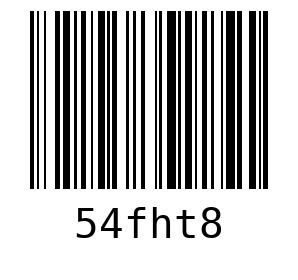

# QR Code and Barcode Generator

<p align="justify">✍This Python script offers a straightforward way to generate both QR codes and barcodes from user input. It leverages the `qrcode` and `python-barcode` libraries to create images of QR codes and barcodes for any given data, such as URLs or numeric codes.</p>

## Features

- Generate a QR code from any text input, like a URL.
- Generate a barcode (using the Code128 standard) from any text input, typically numeric.

## Getting Started

### Prerequisites

Ensure you have Python installed on your system. You will also need the `qrcode` and `python-barcode` packages. If you don't have these packages, you can install them via pip:

```bash
pip install qrcode
pip install python-barcode
```

### Installation
- Clone this repository or download the Python script to your local machine.
- Ensure you have the prerequisites installed.


### Usage
- #### To use the script:
   - ##### 1. Open a terminal or command prompt.
   - #### 2. Navigate to the directory containing the script.
   - ##### 3. Run the script using Python:

   ```bash
   python your_file_name.py
   ```

### QR Code Generation
- The script will first prompt you to "Enter anything which you want:" for the QR code. Enter your desired text (e.g., a URL) and press Enter.
- A QR code image (qrcode.png) will be generated in the current directory.

- #### QR Code
  


### Barcode Generation
- After generating the QR code, the script will prompt again for barcode generation. Enter the desired text (usually numeric) and press Enter.
- A barcode image (barCode.png) will be generated in the current directory.

- #### Bar Code
  